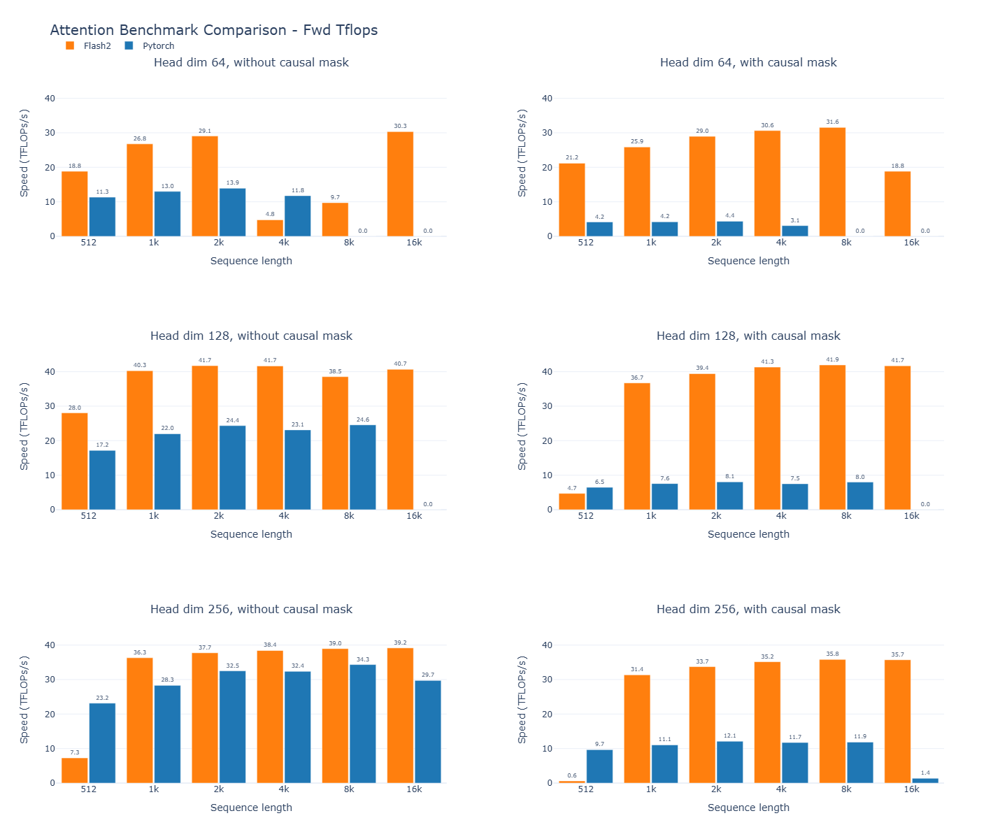
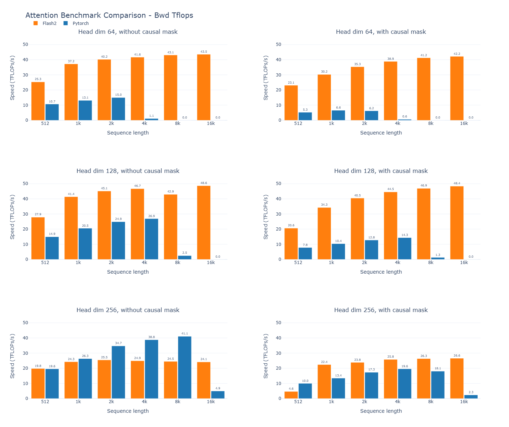
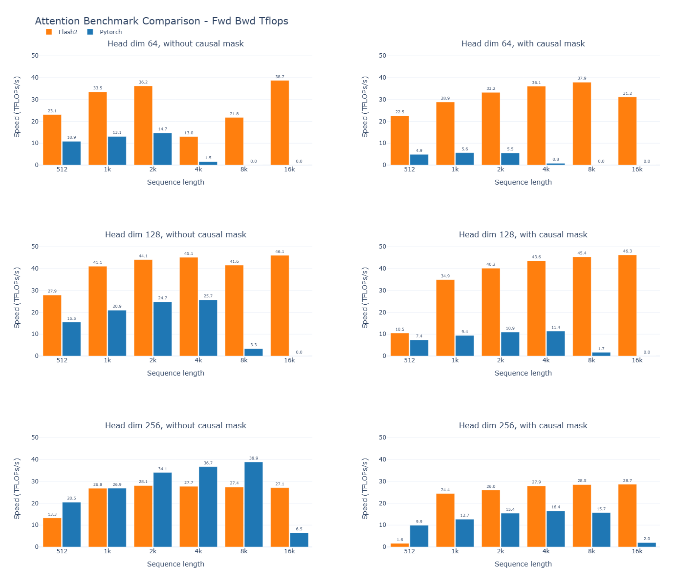

# FlashAttention

This repository provides the official implementation of FlashAttention and FlashAttention-2.

**For complete documentation, installation instructions, usage examples, and general information, please see [README_original.md](README_original.md).**

## Turing GPU (RTX 2080 Ti) Support

This fork adds support for Turing architecture GPUs (compute capability 7.5) to FlashAttention-2, enabling use on GPUs like RTX 2080 Ti and T4.

### Key Changes

- **Turing GPU Support**: FlashAttention-2 now works on compute capability 7.5 GPUs (RTX 2080 Ti, T4)
- **FP16 Only**: Turing implementation supports FP16 precision only (Turing lacks native BFloat16 operations)
- **Architecture Optimizations**: Kernel modifications for Turing's memory and compute constraints

### Installation

Follow the standard installation instructions in [README_original.md](README_original.md). The Turing support is automatically enabled when building on SM75 devices.

**Build Environment:**
- PyTorch 2.9.0
- CUDA 13.0
- Python 3.12.9

### Testing

Test results from `tests/test_flash_attn.py` on Turing GPU:
- **Total tests**: 406,804
- **Passed**: 225,446
- **Failed**: 78
- **Skipped**: 181,280

**Failed Test Areas:**
- **76 failures** in `test_flash_attn_varlen_output` - Variable length attention tests across head dimensions 80, 96, 111, 128, 160, 192, 224, and 256 (both MHA and GQA modes)
- **2 failures** in `test_flash_attn_splitkv` - Split K/V tests with head dimension 96

### Performance Benchmarks - RTX 2080 Ti

Below are benchmarks comparing FlashAttention-2 against PyTorch standard attention on the RTX 2080 Ti with FP16.

**Test parameters:**
* Head dimension 64, 128, or 256
* Sequence length 512, 1k, 2k, 4k, 8k, 16k
* Batch size set to 16k / seqlen

#### Forward Pass

#### Backward Pass

#### Combined Forward + Backward Pass

### Key Performance Insights

- **Speedup increases with sequence length**: FlashAttention-2 shows 1.2-2.4x speedup for forward pass and up to 15-20x for backward pass at longer sequences
- **Memory advantages**: PyTorch standard attention fails (OOM) at longer sequences (8k, 16k) while FlashAttention-2 continues to work
- **Best performance**: Head dimension 64 and 128 show consistent speedups across all sequence lengths
- **Dimension 256 limitation**: Head dimension 256 shows reduced performance benefits, with PyTorch occasionally performing better at shorter sequences. For optimal performance on Turing GPUs, prefer head dimensions 64 or 128

### Acknowledgments

This implementation was inspired by the [ssiu/flash-attention-turing](https://github.com/ssiu/flash-attention-turing) repository.

---

**For all other information including:**
- FlashAttention-3 beta release
- AMD ROCm support
- API documentation and usage examples
- Full feature list and changelog
- Citation information

**Please refer to [README_original.md](README_original.md)**
